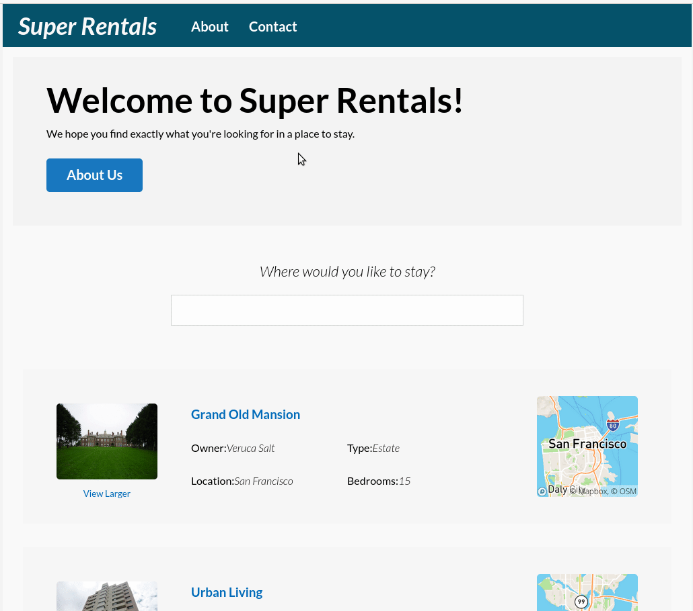

# super-rentals-htmx

Super Rentals demo application built with [htmx](https://htmx.org) and [hyperscript](https://hyperscript.org) in Node.

You can view the demo app live [here](https://super-rentals-htmx.herokuapp.com)

## Usage
Clone this repo, install dependencies and start the app
```
git clone https://github.com/rajasegar/super-rentals-htmx.git
cd super-rentals-htmx
npm install
npm start
```



You might need to add [Mapbox](https://mapbox.com) token to a `.env` file like below
```
MAPBOX_ACCESS_TOKEN=xxxxx-xxxxxx-xxxxx
```


